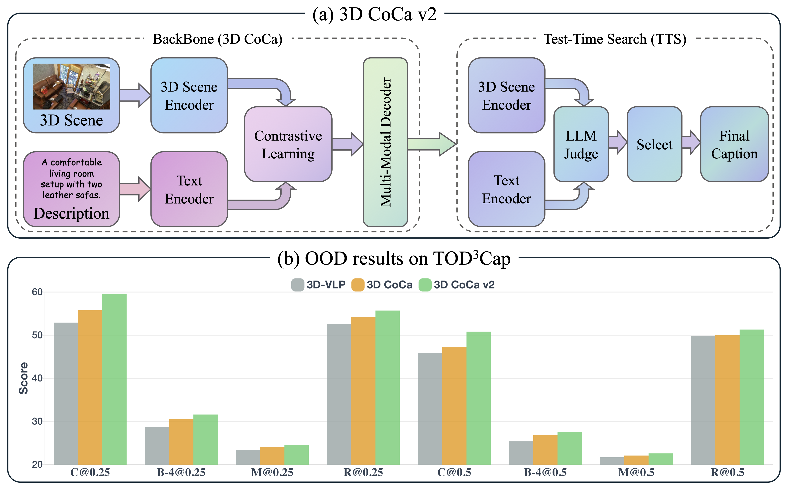

# 3D CoCa v2
Implementation for the paper:
> **3D CoCa v2: Contrastive Learners with Test-Time Search for Generalizable Spatial Intelligence**.
> 
> [Hao Tang](https://ha0tang.github.io/)\*†, [Ting Huang](https://github.com/Believeht029)\*, [Zeyu Zhang](https://steve-zeyu-zhang.github.io/)\*
>
> (\*equal contribution †corresponding author)

[](https://arxiv.org/abs/2601.06496)
[](https://arxiv.org/pdf/2601.06496)
[](https://huggingface.co/AIGeeksGroup/3D-CoCav2)
[](https://huggingface.co/papers/2601.06496)

## 📚 Citation
If you use this repo, please cite:
```
@article{tang20263d,
  title={3D CoCa v2: Contrastive Learners with Test-Time Search for Generalizable Spatial Intelligence},
  author={Tang, Hao and Huang, Ting and Zhang, Zeyu},
  journal={arXiv preprint arXiv:2601.06496},
  year={2026}
}
```


## 🔎 Overview
Spatial intelligence refers to the ability to perceive, reason about, and describe objects and their relationships within three-dimensional environments. 3D captioning aims to describe 3D scenes in natural language but remains challenging due to sparse point clouds and weak grounding across diverse environments.

3D CoCa v2 addresses this by unifying contrastive vision-language learning with 3D caption generation and improving robustness via test-time search (TTS). It builds on frozen CLIP priors, a spatially-aware 3D encoder, and a multimodal decoder optimized with contrastive and captioning objectives. Experiments show gains over 3D CoCa on ScanRefer and Nr3D, and strong zero-shot OOD results on TOD3Cap.



Key components:
- EPCL encoder for 3D geometry
- Frozen CLIP priors
- CoCa-style multimodal decoder with contrastive + captioning loss
- Optional TTS with heuristic or external LLM judge

## 🧰 Environment Setup
Create a clean conda environment and install dependencies:

```bash
conda create --name 3DCoCa python=3.8
conda activate 3DCoCa
conda install ipython pip

pip install matplotlib opencv-python plyfile "trimesh>=2.35.39,<2.35.40" \
  "networkx>=2.2,<2.3" scipy cython transformers h5py

# pointnet2
cd third_party/pointnet2
python setup.py install

cd utils
python cython_compile.py build_ext --inplace
```

## 🗂️ Data Preparation
### ScanRefer / Nr3D
Set dataset paths in the dataset files:
- `datasets/scene_scanrefer.py`: `DATASET_ROOT_DIR`, `DATASET_METADATA_DIR`
- `datasets/scene_nr3d.py`: `DATASET_ROOT_DIR`, `DATASET_METADATA_DIR`

Expected files in `data/` (examples):
- `ScanRefer_filtered_train.json`, `ScanRefer_filtered_val.json`
- `ScanRefer_filtered_train.txt`, `ScanRefer_filtered_val.txt`
- `nr3d_train.json`, `nr3d_val.json`, `nr3d_train.txt`, `nr3d_val.txt`
- Vocabulary JSONs (ScanRefer / Nr3D)

### TOD3Cap
Set environment variables (or place data under `data/tod3cap`):
```bash
export TOD3CAP_ROOT=/path/to/tod3cap
export TOD3CAP_ANN=/path/to/tod3cap/annotations.json
export TOD3CAP_SPLIT=/path/to/tod3cap/splits.json
```

Required fields in `annotations.json`:
```json
{
  "scenes": [
    {
      "scene_id": "scene_0001",
      "pointcloud": "pointclouds/scene_0001.npy",
      "objects": [
        {
          "object_id": 0,
          "category": "car",
          "bbox": { "center": [0, 0, 0], "size": [1, 1, 1] },
          "captions": ["a small car", "a vehicle on the road"]
        }
      ]
    }
  ],
  "splits": { "train": ["scene_0001"], "val": ["scene_0001"] }
}
```
`bbox` can also be `{ "min": [...], "max": [...] }` or `corners: [[...],[...]]`.  
Point clouds are expected as `.npy` or `.npz` arrays (NxC).

## 🏋️ Training
ScanRefer (w/o 2D input):
```bash
python main.py --dataset scene_scanrefer --use_color --use_normal \
  --num_points 40000 --detector 3D_coca \
  --checkpoint_dir pretrained/3D_coca_XYZ_COLOR_NORMAL
```

Nr3D (w/o 2D input):
```bash
python main.py --dataset scene_nr3d --use_color --use_normal \
  --num_points 40000 --detector 3D_coca \
  --checkpoint_dir pretrained/3D_coca_XYZ_COLOR_NORMAL_NR3D
```

Helper script:
```bash
bash scripts/train_scannet.sh
```

## ✅ Evaluation
### Caption evaluation
```bash
# w/o 2D input
python main.py --use_color --use_normal \
  --test_ckpt ckpt/3DCoCa/checkpoint_best.pth --test_caption

# w/ 2D input (multiview)
python main.py --use_color --use_multiview \
  --test_ckpt ckpt_2D/3DCoCa/checkpoint_best.pth --test_caption
```

### Detection evaluation
```bash
python main.py --use_color --use_normal \
  --test_ckpt ckpt/3DCoCa/checkpoint_best.pth --test_detection
```

## 🔍 Test-Time Search (TTS)
Enable TTS (sample multiple captions):
```bash
python main.py --dataset scene_scanrefer --test_caption --test_ckpt ckpt/3DCoCa/checkpoint_best.pth \
  --use_tts --tts_candidates 8 --tts_top_k 50 --tts_temperature 1.0
```

### External LLM judge for TTS
Set API config (OpenAI-compatible Chat Completions):
```bash
export TTS_JUDGE_API_KEY=your_key
export TTS_JUDGE_BASE_URL=https://api.openai.com/v1/chat/completions
export TTS_JUDGE_MODEL=gpt-4o-mini
```
Run with LLM judge:
```bash
python main.py --dataset tod3cap --test_caption --test_ckpt ckpt/3DCoCa/checkpoint_best.pth \
  --use_tts --tts_judge llm --tts_judge_api_key "$TTS_JUDGE_API_KEY" \
  --tts_judge_base_url "$TTS_JUDGE_BASE_URL" --tts_judge_model "$TTS_JUDGE_MODEL"
```


## 🙏 Acknowledgements
We thank the authors of the following open-source repositories for their valuable code and inspiration: [EPCL](https://github.com/XiaoshuiHuang/EPCL), [CoCa](https://github.com/lucidrains/CoCa-pytorch), and [Vote2Cap-DETR](https://github.com/ch3cook-fdu/Vote2Cap-DETR).